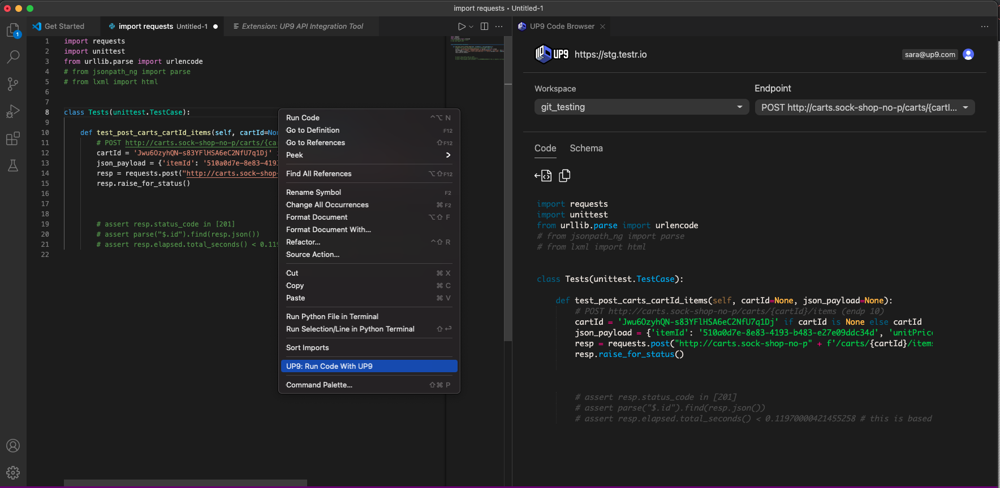
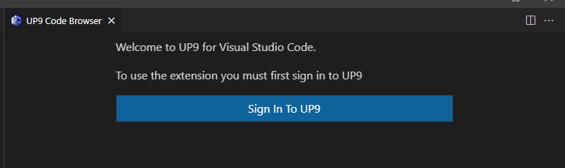
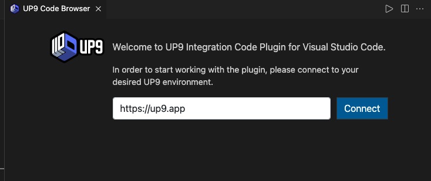
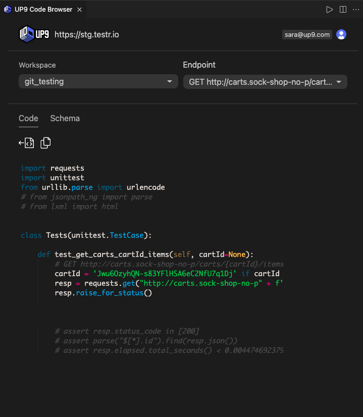
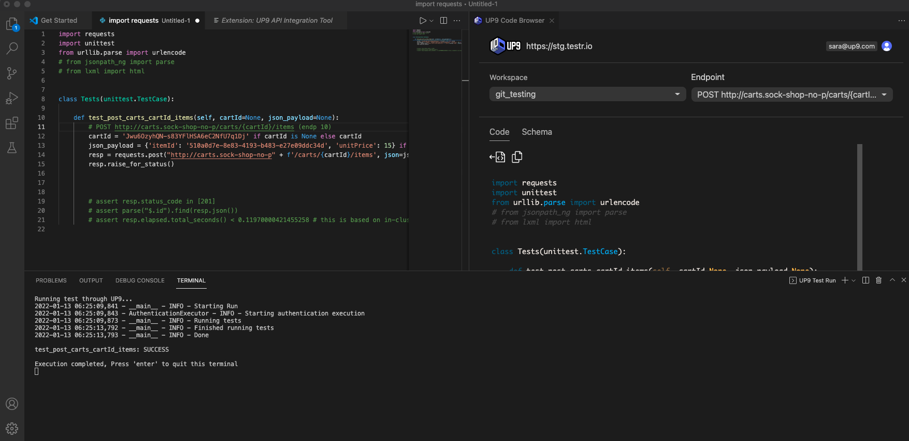

# UP9 for Visual Studio Code

The UP9 IDE enables you to ensure your APIs perform reliably and prevent security vulnerabilities from reaching production, all in your VS Code space. 

This comes in the form of an Integrated Developer Environment (IDE) as a VS Code extension.

## Features
By analyzing application traffic in your Kubernetes cluster, UP9 will monitor your mission-critical workflows, gain understanding of your APIs’ behavior, and effortlessly build API integration and API testing code.

This extension enables UP9 functionality from your IDE, including API endpoint integration, testing and troubleshooting. All in all, this enables faster development and more reliable services by testing earlier in the SDLC.

## Install the extension
You can find the UP9 Extension in the Visual Studio Code Marketplace. To install either:

* Navigate to the UP9 extension in the Visual Studio Marktplace and follow the instructions. The docs from VS Code help you trigger the installation process from Visual Studio Code and guide you through the installation steps. 
* Browse for the extension in as advised [here](https://code.visualstudio.com/docs/editor/extension-marketplace#_browse-for-extensions), search for UP9 and then install.
* Download VSIX extension package from UP9 [artifact store on GitHub](https://github.com/up9inc/vscode-up9/releases), and install as guided [here](https://code.visualstudio.com/docs/editor/extension-marketplace#_install-from-a-vsix)

## Quick start

-  Press `Command-Shift-P` to access VS Code command launcher and select **UP9: Open Code Browser** from the list. This will open a right-pane window offering you to sign in to your UP9 account:

-   Complete the required fields and select **Connect** - this connects your UP9 account to the IDE. Once connected, you can begin using UP9 extension.

## Using the UP9 extension in VS Code IDE

1. Select your UP9 workspace and the endpoints from the drop-down lists.
 
2. Now you can view sample test code for selected endpoints on the screen. You can also view a basic schema, including parameters and request/response bodies.
  * You can see the sample integration code for the selected API endpoint  
    

  * Or you can view the API Request parameters, Request or Response body schema, parameters, etc.
    

3. You can use **COPY** button to copy the sample code into clipboard, or use **INSERT** button to include sample code into the file edited in the left-pane. If the edited file is empty, the entire code will be included, otherwise - code will be inserted as function at the cursor location.
  * **NOTE**: You may notice somem assertions that are commented out at the bottom of the code sample. These are   there to help you create API tests easily and efficiently. Uncomment those to use them in your tests.

## Running your code using UP9
1. Select **UP9: Run Code with UP9** in right-click menu of your Python code browser to run code via UP9 agent configured in your Kubernetes cluster.
  
  

2. Test run output is shown in the bottom pane after the execution.
  
  

# More details
[Visit here](up9.com/docs/up9-ide) for more details.

For support, follow these processes:

-   Join our community Slack at [up9.slack.com](https://join.slack.com/t/up9/shared_invite/zt-tfjnduli-QzlR8VV4Z1w3YnPIAJfhlQ).
-   Email [support@up9.com](mailto:support@up9.com).

